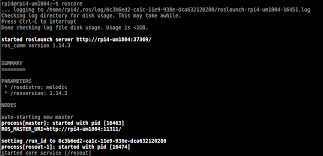

# Welcome to Ros_Training

โปรแกรมสำหรับดาวร์โหลด    [https://github.com/ohmranger/src](https://github.com/ohmranger/src).

## การติดตั้งโปรแกรม ROS_Melodic
#### 1.1 เข้าไปที่เว็บไซต์หลักของ [ROS](https://www.ros.org/) และติดตั้งจากคำสั่งของ ROS หรือเปิด Terminal `ctrl+alt+T` แล้วคัดลอกคำสั่งลงไป
>* ขั้นเตรียม
    
    sudo sh -c 'echo "deb http://packages.ros.org/ros/ubuntu $(lsb_release -sc) main" > /etc/apt/sources.list.d/ros-latest.list'
    sudo apt-key adv --keyserver 'hkp://keyserver.ubuntu.com:80' --recv-key C1CF6E31E6BADE8868B172B4F42ED6FBAB17C654` 
    sudo apt update

>* ขั้นติดตั้ง

    sudo apt install ros-melodic-desktop-full

>* ทำการ Initialize rosdep

    sudo rosdep init
    rosdep update

>* ทำการ Environment setup

    echo "source /opt/ros/melodic/setup.bash" >> ~/.bashrc
    source ~/.bashrc
    source /opt/ros/melodic/setup.bash

>* ทำการติดตั้ง Dependencies สำหรับการ building packages

    sudo apt install python-rosinstall python-rosinstall-generator python-wstool build-essential
    sudo apt-get install ros-melodic-joy ros-melodic-teleop-twist-joy ros-melodic-teleop-twist-keyboard ros-melodic-laser-proc ros-melodic-rgbd-launch ros-melodic-depthimage-to-laserscan ros-melodic-rosserial-arduino ros-melodic-rosserial-python ros-melodic-rosserial-server ros-melodic-rosserial-client ros-melodic-rosserial-msgs ros-melodic-amcl ros-melodic-map-server ros-melodic-move-base ros-melodic-urdf ros-melodic-xacro ros-melodic-compressed-image-transport ros-melodic-rqt-image-view ros-melodic-navigation ros-melodic-interactive-markers ros-melodic-driver-base ros-melodic-image-transport ros-melodic-image-publisher ros-melodic-vision-msgs ros-melodic-rospy-message-converter ros-melodic-dwb-critics ros-melodic-costmap-queue

---------------------------------------------------------------------------------------------------------

## ทดสอบโปรแกรมหลังจาการติดตั้ง ROS
### 1.2 ทดสอบ ROS  โดยเปิด Terminal ขึ้นมา `ctrl+alt+T`

    roscore
>   จะปรากฎดภาพดังรูป

    
Note

    

        หากเกิด ERROR ให้ติดตั้งที่ ROS หลัก
    

