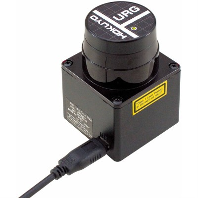
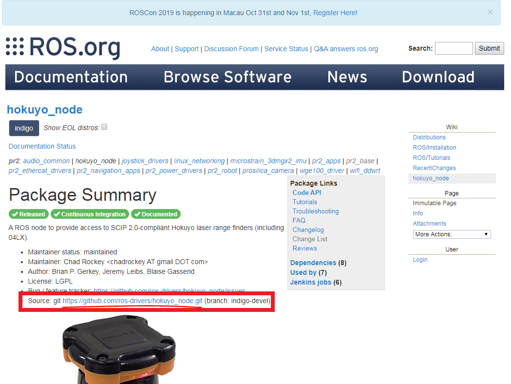

# การติดตั้งโปรแกรม Package

## การติดตั้ง Package ของ  hokuyo sensor scanner 

## Product Highlightse ของ  hokuyo sensor scanner 
__Description__
>*    Hokuyo's URG-04LX-UG01 detectable range is 20mm to 5600mm 
>*    100msec/scan 
>*    5V operating voltage 
>*    240° area scanning range with 0.36° angular resolution 
>*    USB cable not included

## ขั้นตอนการติดตั้ง Package Hokuyo
1. ให้เข้าไปที่เว็บไซต์ [http://wiki.ros.org/hokuyo_node](http://wiki.ros.org/hokuyo_node)
2. คลิกแหล่งเก็บข้อมูลของโปรแกรม ดังภาพ  หรือคลิกที่ลิงค์ [https://github.com/ros-drivers/hokuyo_node](https://github.com/ros-drivers/hokuyo_node)

3. เปิด Terminal ขึ้นมาโดยกด  `ctrl+alt+T` แล้วคัดลอกคำสั่งลงไป
4. 
```
cd /catkin_ws/src
git clone https://github.com/ros-drivers/hokuyo_node.git
cd ..
catkin_make
source devel/setup.bash
```
5. Run Program ด้วยคำสั่ง
